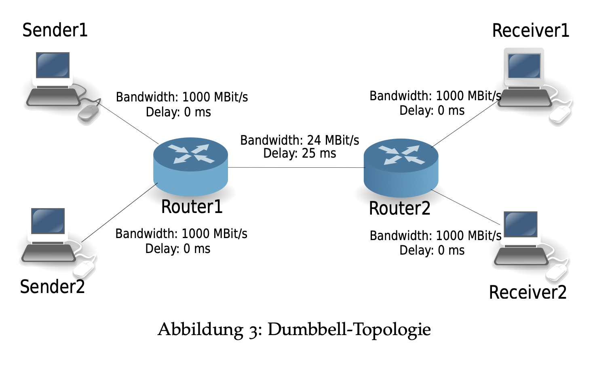
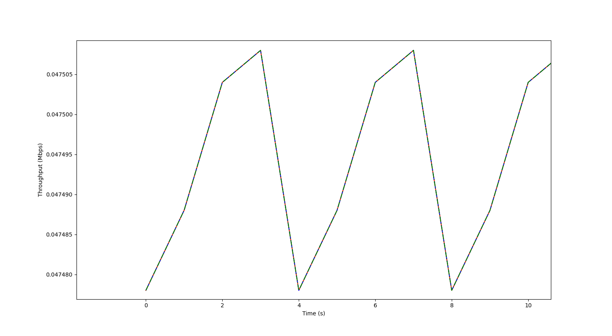

# Scripts for first session

## Lab
### Description
I've created an "exact" replica of lab environment that we're supposed to work with in Emulab using docker/compose.

> [!NOTE]
> Almost everything from the lab can be tested except for experiments that involve changing the TCP modes (Tahoe, Reno, cubic...) in the kernel.
This is a limitation of docker containers as they share the same kernel as their docker host and must therefore use the same mode.
So you sadly can't test the last experiments from the lab that test the effect of different TCP modes.

The topology is a Dumbbell topology like the following one.



`sender1` and `sender2` can't communicate with `receiver1` and `receiver2` directly, and have to do so though the two routers `router1` and `router2`.

I've also added an extra `student` computer that's connect diretly to all the nodes (computers/routers) and contains all the scripts for the first session for you to test out.

### How to setup
1. Install docker and docker compose (find the instructions on the internet)
2. **Inside this folder** run
    ```shell
    docker build -t rn-lab-sess-1 .
    ```
3. **Inside this folder** run
    ```shell
    docker-compose -f docker_compose.yaml up -d
    ```
    this will setup all the clients/networks
4. when you're done running the scripts and testing stuff you can stop the environment and clean everything using
    ```shell
    docker-compose -f docker_compose.yaml down
    ```

### How to use
The username and password to **all** the machines is "root" and "password"
1. ssh to the `student` machine using this command (same password)
    ```shell
    ssh -o StrictHostKeyChecking=no -o UserKnownHostsFile=/dev/null root@127.0.0.1 -p 2222
    ```
    now you are the `student` machine (inside the docker virtual environment)
2. `cd scripts`
3. Now you can run any of the scripts in this folder and the ouptut will be written to the folder `output` **ON YOUR HOST** which means you can access the files directly from your computer without having to copy them back and forth between docker and the host
4. Now you can also ssh to any machine (from the student VM) using
    ```shell
    ssh root@sender1 # router1, router2, receiver1...
    ```
    password is always "password"

## Scripts
### Get nodes information
`./get_nodes_infos.sh` will:
1. run `ifconfig` on all the nodes in the network
2. from every node to each other node (NxN) it will run `ping` to get the RTT
3. from every node to each other node (NxN) it will run `traceroute` to get the hops along the way

### Run UDP stress test and get log
`./udp_stress_test.sh` will:
1. run UDP stress test using iperf between `sender1`->`receiver1` and `sender2`->`receiver2` at the "same" time (miniscule difference in time)
2. retrieve the logs from `receiver1` and `receiver2` and save them under `output` as CSV file with headers

### Run TCP stress test and get log
`./tcp_stress_test.sh` will:
1. run UDP stress test using iperf between `sender1`->`receiver1` with 1,2, and 4 parallel streams
2. retrieve the logs for each test from `receiver1` and save them under `output` as CSV file with headers

### Plot TCP stress test results
`./plot_stress_test.py` will:
1. Plot the results from the 3 TCP parallel streams stress test overlayed, like this


### Disable TSO on all nodes
`./run_disable_tso_on_targets.sh` will:

1. copy `./disable_segmentation_offload.sh` to all the nodes and run it to disable TSO on all nodes at the same time

2. delete the file after it's run


### Run TCP stress with TCP dump

`./tcp_stress_test_tso_off.sh` will:
1. start `iperf` server on `receiver1`
2. start `tcpdump` (with filters) on `router1`
3. start the TCP stress test from `receiver1`
4. retrieve the dump file from `router1`
you can access the PCAP file, like I said, directly from your computer.\
The file can be huge (5 GB)

### Set bandwith, buffer size, and delay of router1 and router2
`./set_link_capacity.sh` will:
1. limit the capacity to 20 Mbit with 10ms delay (on the specified interface)
2. set the buffer size as 10 packets (on the specified interface)

### Test influence of buffer size

`./test_buffer_size.sh` will:
1. Disable TSO on all nodes
2. Set link capacity on router 1 and router 2 to 10
3. Run iperf tcp stress test between sender1 and receiver1
4. Copy results back and save them in `output`
5. Set link capacity on router 1 and router 2 to 100
6. Run iperf tcp stress test between sender1 and receiver1
7. Copy results back and save them in `output`


### Stress test tcp udp same time

`./tcp_stress_test_tcp_and_udp.sh` will:
1. Send TCP traffic using iperf from sender1 -> receiver1 for 120 seconds
2. After 30 seconds send 10 Mbps UDP traffic from sender2 -> receiver2
3. After 30 seconds send 30 Mbps UDP traffic from sender2 -> receiver2
4. After 30 seconds send 50 Mbps UDP traffic from sender2 -> receiver2
5. Retrieve the TCP throughput from receiver1 and receiver2